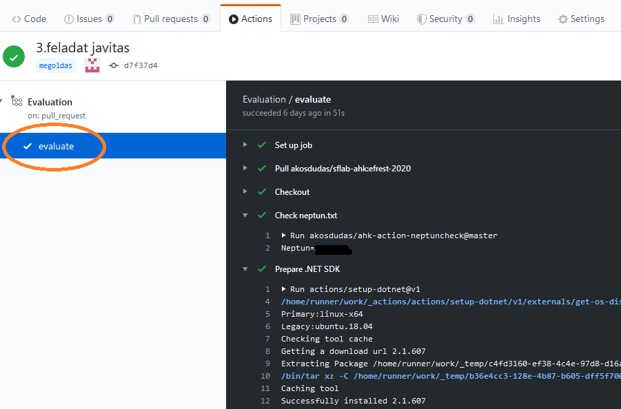
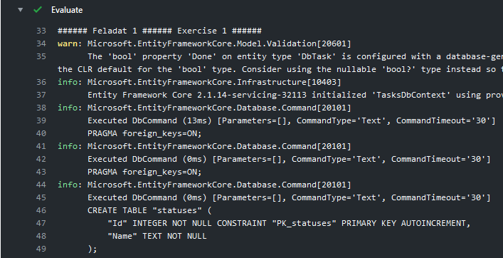

# Using GitHub Actions

The semi-automatic evaluation of the exercises is based on [GitHub Actions](https://github.com/features/actions). It is a CI system capable of running jobs on git repositories. We use this system for example to compile your code and test it.

You will receive a notification about the results in a pull request. But if you need more details, such as check the application logs, you can access these using the web interface of GitHub under _Actions_.

Here, you will see a list of _Workflows_.

By selecting one (e.g. the last one is always at the top of the list) you see the details of this workflow. To get to the logs you need to click once more on the left. The log will be on the right side.

Each green checkmark is a successful step. These steps do not correspond to you exercises; these describe the evaluation process. These steps include preparations, such as setting up the .NET environment for compiling your code (since each workflow starts in a clean environment, these steps are performed each time).

Most of these steps should be successful, even if your submission contains an error. The two exceptions when these tasks might fail due to your changes are: (1) if `neptun.txt` is missing, or (2) your C# code does not compile. The `neptun.txt` is mandatory and no evaluation is performed until that is provided. The C# compilation is a step that must succeed, otherwise your application cannot be started.

There might be transient errors in these workflows. An example is when a download, such as the download of the .NET environment fails. The workflow execution can be repeated if this occurs. Obviously retrying the execution may only help if the problem is indeed transient; a C# compilation error will not be resolved by a retry. (You can deduce the cause from the name of the step and the error message.)

You might also be able to access the application logs. E.g. when testing a .NET application, it is started and the logs will be printed here.

The image below shows the initialization of an Entity Framework application where you can also see the translated and executed SQL commands. (You would see the same in Visual Studio _Output_ while debugging.) The content here, obviously, depends on the actual exercise.

