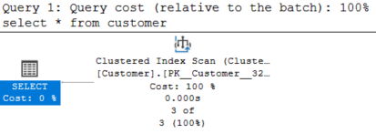
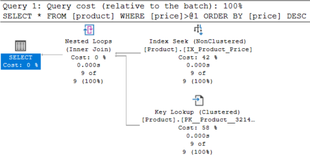
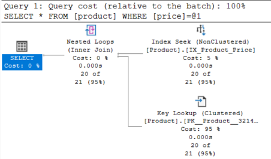
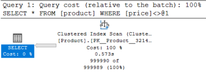

# Exercises solved together

!!! example "SUBMISSION"
    The submission shall be a documentation written in the `README.md` file:

    - document the SQL commands (if the exercise tells you to),
    - a screenshot of the query plan (just the plan and _not_ the entire desktop!),
    - and an explanation: _what_ do you see on the query plan and _why_ the system chose this option.

**Even though the solutions are provided below, you are required to execute the queries, get the execution plan, think about it, and document it.**

If the query plan or the explanation of subsequent exercises is the same, or at least very similar, it is enough to document everything once (one screenshot and one reasoning); and list which (sub)exercises it is the solution for.

## Exercise 1 (2p)

Drop the `CustomerSite` => `Customer` foreign key and the `Customer` table primary key constraint. Find these in the _Object Explorer_ and delete them (the _PK..._ is the primary key while the _FK..._ is the foreign key - the ones you need to delete are in two different tables!):


Execute the following queries on the `Customer` table and examine the execution plans (always fetch the entire records using `select *`):

- a) query the whole table
- b) get one record based on primary key
- c) querying records where the primary key is not a specified constant (use the `<>` comparison operation for not equals)
- d) querying records where the primary key is greater than a specified constant
- e) querying records where the primary key is greater than a specified constant, ordering by ID descending  

Document the SQL commands you used and explain the actual query execution plan!

??? success "Solution"
    The SQL **queries**:

    - a) `select * from customer`
    - b) `select * from customer where id = 1`
    - c) `select * from customer where id <> 1`
    - d) `select * from customer where id > 1`
    - e) `select * from customer where id > 1 order by id desc`

    **a)-d)**

    The **execution plan** is indentical for all, it uses a _table scan_ each time:

    

    **Explanation**: the optimizer cannot use any index, as there is none. Thus there is no other choice but to use a _table scan_.

    **e)**

    This one is a little different due to the order by there is a sort stage too.

    

    **Explanation**: The _table scan_ is the same, and after that, there is still a need for sorting - without any index, it is a separate stage.

## Exercise 2 (2p)

Re-create the primary key of the `Customer` table:

- Right-click the table > Design > then right-click the ID column "Set Primary Key " then Save,
- or execute `ALTER TABLE [dbo].[Customer] ADD PRIMARY KEY CLUSTERED ([ID] ASC)`

Re-run the same queries as in the previous exercise. What do you experience?

??? success "Solution"
    The commands are the same as before.

    **a)**

    

    The Clustered Index Scan iterates the table. We have a Clustered Index automatically created for the primary key, which has the records sorted by ID. By iterating through this index, all records are visited. This is almost identical to a Table Scan, though, not efficient. However, this is what we asked for here.

    **b)**
    
    

    A Clustered Index Seek is enough. Since the filter criteria is for the ID, for which there is an index available, the matching record can be found quickly. This is an efficient plan; the Clustered Index is used for the exact purpose we created it for.

    **c)**

    Similar to the previous one, a Clustered Index Seek between two intervals (`< constant`, `> constant`). Since the filter criteria still references the ID field with a Clustered Index, the query will use this index. This is an efficient query.

    **d)**

    Very similar to the previous one with a range filter.

    **e)**
    
    

    Clustered Index Seek with a backward seek order. The _Properties_ window shows the Seek Order-t: find the last matching record, and walk the index backward, which will yield a sorted result set.

## Exercise 3 (2p)

Execute the following queries on the `Product` table.

- f) query the whole table
- g) search for specific records where `Price` equals a value
- h) query records where `Price` is not a specified constant (<>)
- i) query records where `Price` is greater than a value
- j) query records where `Price` is greater than a value, ordered by `Price` descending

Document the SQL commands you used and explain the actual query execution plan!

??? success "Solution"
    The SQL **commands**:

    - f) `select * from product`
    - g) `select * from product where price = 800`
    - h) `select * from product where price <> 800`
    - i) `select * from product where price > 800`
    - j) `select * from product where price > 800 order by price desc`

    **f)-i)**

    

    A Clustered Index Scan iterates through the contents of the index. This is still equal to reading the entire table since there is no index to match the filter criteria. Although a Clustered Index is used, it does not serve any purpose in filtering; all records are visited, and the filter is evaluated for each. These are not efficient queries, as the existing index is of no use.

    **j)**
    
    
    
    Still a Clustered Index Scan, but what is interesting is that cost of the sorting stage is quite large. Even after executing a costly Index Scan, we still have further sorting to do. A good index would help, but there is no index for the sorted column.

## Exercise 4 (2p)

Add a new non-clustered index on column `Price`. How do the execution plans change?

To add the index use _Object Explorer_, find the table, expand it, and right-click _Indexes_ -> _New index_ > _Non-Clustered Index..._


Indices should have meaningful names, e.g., `IX_Tablename_Fieldname`. Add _Price_ column to the _Index key columns_ list.


Repeat the queries from the previous exercise and explain the plans!

??? success "Solution"
    The SQL commands are the same as in the previous exercise.

    **f)**

    Despite the new index, it is still an Index Scan - since we asked for the contents of the entire table.

    **g)-i)**
    
    Clustered Index Scan iterating through the entire table, just as if there was no index available for the filtered column.
    
    Why does it not use the new index? The reason is the projection; that is, we query the entire record. The NonClustered Index could yield a set of record identifiers, after which the records themselves would still need to be queried. The optimizer decides that it is not worth doing so; an Index Scan is more efficient.

    **j)**
    
    
    
    The NonClustered Index Seek yields keys, which are looked up in the Clustered Index, just like joining the two indices.

    We would have expected something similar in the previous queries too. The Clustered Index is needed as entire records are fetched as the NonClustered Index only provides references. However, these references are in the correct order (the NonClustered Index ensures it); so after the lookup in the Clustered Index, there is no further need to do the sorting. If only the Clustered Index were used (Clustered Index Scan), the sorting would have to be performed in a separate stage. This is an acceptable query, as the NonClustered Index helps in avoiding a costly sorting step.

## Exercise 5 (2p)

Generate new records into the _Product_ table with the script below. How do the execution plans change?

When repeating the query for sub-exercise i), choose a constant value that will yield few resulting records, then choose a value that returns almost all records. Explain the differences!

```sql
SELECT TOP (1000000) n = ABS(CHECKSUM(NEWID()))
INTO dbo.Numbers
FROM sys.all_objects AS s1 CROSS JOIN sys.all_objects AS s2
OPTION (MAXDOP 1);

CREATE CLUSTERED INDEX n ON dbo.Numbers(n)
;


INSERT INTO Product(Name, Price, Stock, VATID, CategoryID)
SELECT 'Apple', n%50000, n%100, 3, 13
FROM Numbers
```

??? success "Solution"
    The SQL commands are the same.

    **f)**
    
    Same as before.

    **g)**
    
    

    References from the NonClustered Index Seek are looked up in the Clustered Index, just like joining the two indices.

    Let us compare this plan to the one from before having a smaller table. Why is the Clustered Index Scan not used now? In the case of larger tables, the _selectivity_ (i.e., how many records match the filtering) is more important, hence the use of the NonClustered Index. The Clustered Index Scan would be too costly in a large table. The NonClustered Index can reduce the number of records, hence its role here. Based on the statistics of the `Price` column, it can be derived that the `=` operator will match few records. Important! Just because it is an `=` comparison, it does not directly follow that there are few matches; imagine the column having the same value in all records. Hence the need for the statistics!
    
    This is an acceptable query. Since the filtering reduces the number of records, it is worth using the index.

    **h)**
    
    

    Clustered Index Scan as before.
    
    Why the difference compared to the previous case? If the `=` operator yields few matches, then `<>` will yield many. This is derived from the statistics too. So no use in doing the same as in the previous case; a Clustered Index Scan is probably more efficient.

    **i)**

    The plan depends on the constant. If it yields few matches, similar to g); otherwise the same as in h).

    **j)**
    
    Just like for g). Does the `order by desc` matter here? The optimizer tries to avoid sorting, and this is the only way to do so. This is an acceptable plan; by using the NonClustered Index there is no separate sorting stage.
