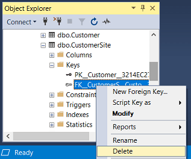
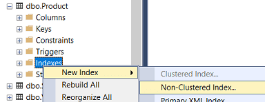

# Exercises solved together

!!! example "SUBMISSION"
    The submission shall be a documentation written in the `README.md` file:

    - document the SQL commands (if the exercise tells you to),
    - a screenshot of the query plan (just the plan and _not_ the entire desktop!),
    - and an explanation: _what_ do you see on the query plan and _why_ the system chose this option.

!!! tip ""
    If the query plan and/or the explanation of subsequent exercises is the same, or at least very similar, it is enough to document everything once (one screenshot and one explanation); and list which (sub)exercises it the solution for.

## Exercise 1 (2p)

Drop the `CustomerSite` => `Customer` foreign key and the `Customer` table primary key constraint. Find these in the _Object Explorer_ and delete them (the _PK..._ is the primary key while the _FK..._ is the foreign key - the ones you need to delete are in two different tables!):



Execute the following queries on the `Customer` table and examine the execution plans (always fetch the entire records using `select *`):

- a) query the whole table
- b) get one record based on primary key
- c) querying records where the primary key is not a specified constant (use the `<>` comparison operation for not equals)
- d) querying records where the primary key is greater than a specified constant
- e) querying records where the primary key is greater than a specified constant, ordering by ID descending  

Document the SQL commands you used and explain the actual query execution plan!

## Exercise 2 (2p)

Re-create the primary key of the `Customer` table:

- Right click the table > Design > then right click the ID column "Set Primary Key " then Save,
- or execute `ALTER TABLE [dbo].[Customer] ADD PRIMARY KEY CLUSTERED ([ID] ASC)`

Re-run the same queries as in the previous exercise. What do you experience?

## Exercise 3 (2p)

Execute the following queries on the `Product` table.

- f) query the whole table
- g) search for specific records where `Price` equals a value
- h) query records where `Price` is not a specified constant (<>)
- i) query records where `Price` is greater than a value
- j) query records where `Price` is greater than a value, ordered by `Price` descending

Document the SQL commands you used and explain the actual query execution plan!

## Exercise 4 (2p)

Add a new non-clustered index on column `Price`. How do the execution plans change?

To add the index use _Object Explorer_, find the table, expand it and right click _Indexes_ -> _New index_ > _Non-Clustered Index..._



Indices should have meaningful names, e.g. `IX_Tablename_Fieldname`. Add _Price_ column to the _Index key columns_ list.


Repeat the queries from the previous exercise and explain the plans!

## Exercise 5 (2p)

Generate new records into the _Product_ table with the script below. How do the execution plans change?

When repeating the query for sub-exercise i), chose a constant value that will yield few resulting records, then chose a value that returns almost all records. Explain the differences!

```sql
SELECT TOP (1000000) n = ABS(CHECKSUM(NEWID()))
INTO dbo.Numbers
FROM sys.all_objects AS s1 CROSS JOIN sys.all_objects AS s2
OPTION (MAXDOP 1);

CREATE CLUSTERED INDEX n ON dbo.Numbers(n)
;


INSERT INTO Product(Name, Price, Stock, VATID, CategoryID)
SELECT 'Apple', n%50000, n%100, 3, 13
FROM Numbers
```
