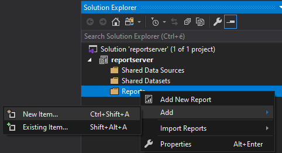
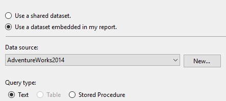
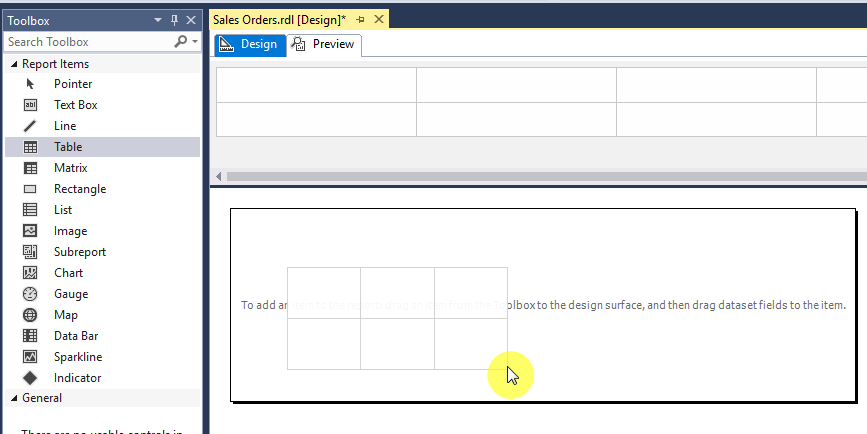
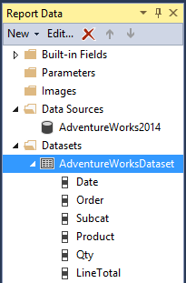
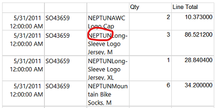
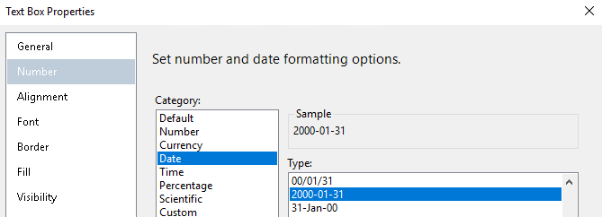
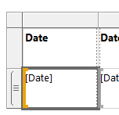
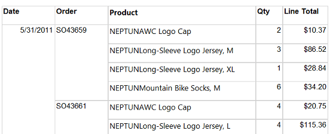
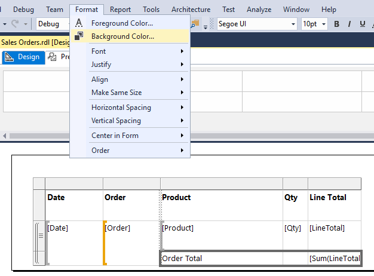
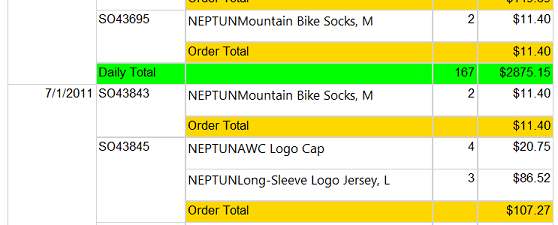

# Exercise 1: Table report

This exercise is **solved together** with the lab instructor.

In the checked-out repository, locate file `reportserver.sln` and open it with Visual Studio. This is an empty _Report Server_ project.

The Report Server project consists mainly of _Report Definition_ (.rdl) files, that define the data sources (queries) and a template, which, when rendered, produces the final result: a report. These reports can be installed to a _Report Server_ and executed there, providing the users with up-to-date data.

!!! note ""
    In this lab, we will not use the Report Server. This is mainly because the configuration would require administrative privileges that we do not have in the labs. Therefore, we will preview the reports in Visual Studio.

## Create the first Report Definition file

1. In the _Solution Explorer_ right-click _Reports_ and choose _Add_ > _New Item_.

    

1. Choose the _Report_ type from among the listed templates. Call it _Sales Orders.rdl_, then click Add.

    ??? fail "If adding the new report file fails"
        In certain Visual Studio and Report Server project versions adding this new report file might fail. If this happens, follow these steps instead.

        1. Download [this empty rdl file](empty.rdl).
        1. Save the file with the correct name to the `reportserver` folder of your repository (this folder already exist).
        1. In Visual Studio right-click _Reports_ then choose _Add_ > _Existing Item_, and browse for this file.

1. Open the report file to get the Report Designer view. Here, the new .rdl file is displayed in the Design view.

    

    This is our development view. The Report Designer has two views: _Design_ and _Preview_. A panel called Report Data (on the left) is also opened. Here, we can define data sources. If the data sources are set, we can create the report on the _Design_ tab and check how it would look like on the _Preview_ tab.

## Configuring the data source

A data source defines where our data comes from. This will be the SQL Server database created before.

1. Using the _Report Data_ pane, click _New_ > _Data Source_. The name shall be "AdventureWorks2014."

    

1. Choose _Microsoft SQL Server_ as the connection type and click the button to the right of _connection string_ to configure the database access

    - Server name: `(localdb)\mssqllocaldb`
    - Authentication: `Windows Authentication`
    - Select or enter database name: `AdventureWorks2014`

1. Click OK to close the dialog. Then **re-open** the Data Source settings from the Report Data panel by right-clicking on the newly created data source, opening its properties, and then going to the _Credentials_ page. The following checkbox has to be checked:

    

## Configuring a data set

The next step is the configuration of a dataset. Practically, this means executing a query in the database.

1. Using the _Report Data_ pane, click _New_ > _Data Set_. Call the dataset "AdventureWorksDataset." Select the data source created before from the dropdown, then apply the following settings:

    

1. Copy the following query.

    ```sql
    SELECT
    soh.OrderDate AS [Date],
    soh.SalesOrderNumber AS [Order],
    pps.Name AS Subcat, pp.Name as Product,
    SUM(sd.OrderQty) AS Qty,
    SUM(sd.LineTotal) AS LineTotal
    FROM Sales.SalesPerson sp
    INNER JOIN Sales.SalesOrderHeader AS soh
          ON sp.BusinessEntityID = soh.SalesPersonID
    INNER JOIN Sales.SalesOrderDetail AS sd
          ON sd.SalesOrderID = soh.SalesOrderID
    INNER JOIN Production.Product AS pp
          ON sd.ProductID = pp.ProductID
    INNER JOIN Production.ProductSubcategory AS pps
          ON pp.ProductSubcategoryID = pps.ProductSubcategoryID
    INNER JOIN Production.ProductCategory AS ppc
          ON ppc.ProductCategoryID = pps.ProductCategoryID
    GROUP BY ppc.Name, soh.OrderDate, soh.SalesOrderNumber,
             pps.Name, pp.Name, soh.SalesPersonID
    HAVING ppc.Name = 'Clothing'
    ```

    Click _Refresh fields_ when ready.

    !!! note ""
        We have a Query Designer where the query can be created with visual aids. We will not use it, but it is available.

    Click OK to close the dialog.

## Table report (5p)

Now that we have our connection to the database and the query that will supply the data, let us create a report. A report is basically data from the database displayed in a table or with diagrams.

1. Open the _Toolbox_ pane. You can do this from the _View_ menu.

1. From the _Toolbox_ choose _Table_ and draw a table on the big, empty and white canvas on the Design tab:

    

1. Switch back to the _Report Data_ pane and expand the AdventureWorksDataset:

    

    !!! info ""
        If the node is empty or cannot be opened, you need to re-open the data set properties using right-click, then clicking the _Refresh Fields_ button.

1. Drag the _Date_ field to the first column of the table. It should look like this:

    

    !!! note ""
        The `[Date]` in the second row shows the expression to evaluate, while "Date" in the first row is the literal header label - we can change it too.

1. Similarly, add _Order_ and _Product_ to the second and third columns. Add _Qty_ as well: drag it to the right side of the last column; the cursor icon will change to + sign, and a blue line at the end of the table will appear. This will add a new fourth column. Add _LineTotal_ similarly into the fifth column.

    

1. The first report is almost ready. Let us check how it looks like using the Preview tab. Note that it might take a while for it to open the first time. It will be faster the second time. Verify that your Neptun code appears in the table content! (If not, you forgot a preparation step. Go back, and repeat the steps!)

    

    We can print or export the report into various formats (e.g., Word, Excel, PDF). However, this report is not very pretty, e.g., the currency is not displayed, and the Qty and date columns are not formatted, etc. 

1. Go back to _Design_ tab, right-click the `[Date]` expression, and select Text Box Properties. Navigate to the _Number_ page, select the _Date category_, and choose a date format you like.

    

1. Right-click `[LineTotal]`, use Text Box Properties again, and select the _Currency_ option in _Number_.

    

1. By moving the mouse over the gray boxes at the top of the table header, the cursor changes to resize mode. (Just like you would resize a table in Word.) Use this to resize the entire table, and the columns (_Qty_ and _Line Total_ can be narrower, while the others might need more space).

    Finally, emphasize the header row. Select the whole row (by clicking the gray rectangle on the left end of the row) and click _Bold_ on the ribbon.

    

    If you check the preview, it should look like this:

    

!!! example "SUBMISSION"
    _If you are continuing with the next exercise, you may omit to create the screenshot here._

    Create a screenshot of the **report preview** page. Save the screenshot as `f1.png` and submit it with the other files of the solution. The screenshot shall include Visual Studio and the report preview. Verify that your **Neptun code** is visible!

    Upload the changed Visual Studio project and its corresponding files too.

## Grouping and total value (5p)

The report we created is very long, and it contains everything without structure. These are retail sales information: the amount of products sold each day. Let us group the data.

1. Go back to _Design_ tab. Make sure that we see the _Row Groups_ pane below the table. If it is not there, right-click the design area and select _Grouping_ in the _View_ menu.

1. Drag the _Date_ field from _Report Data_ to the _Row Groups_ pane above the _(Details)_ row.

    

    The table will look like this:

    

1. Drag field _Order_ into _Row Groups_ between _Date_ and _(Details)_.

    

1. Now there are duplicate columns in the table. Let us delete these. Select the rightmost _Date_ and _Order_ columns by clicking on the gray boxes above them. Delete them by right click and _Delete Columns_.

    

    Unfortunately, the new _Date_ column format is now lost, but you can set it again as previously.

    Check the _Preview_ now, and see that the table is now ordered and grouped as we specified it.

    

1. Go back to the _Design_ view. Right-click the `[LineTotal]` cell and click _Add Total_. This will add a total for each _Order_ (which we used for grouping). There will be no label added to this line. Add one by left-clicking the cell and typing: "Order Total."

    

1. Holding the CTRL key pressed down, click _Order Total_, and the two cells to the right to select them all. Then set a background color by choosing one from the _Format_ menu.

    

1. Check the preview of the report now.

    

1. Let us create a daily total as well!

    - Go back to the _Design_ view.
    - Right-click on the `[Order]` cell and click _Add Total_ > _After_.
    - A new cell (Total) appears below `[Order]`. Click in it and change the label to "Daily Total".
    - Select the cell and the three right next to it (e.g., by using CTRL and clicking them) and change their background color (_Format_ > _Background color_).

1. Since there are quite a few orders per day, you may need to scroll down 4-5 pages to check the result in the preview:

   

!!! example "SUBMISSION"
    Create a screenshot of the **report preview** page. Save the screenshot as `f1.png` and submit it with the other files of the solution. The screenshot shall include Visual Studio and the report preview, including the **lines showing the totals** (a turn a few pages if needed to see one). Verify that your **Neptun code** is visible!

    Upload the changed Visual Studio project and its corresponding files too.
