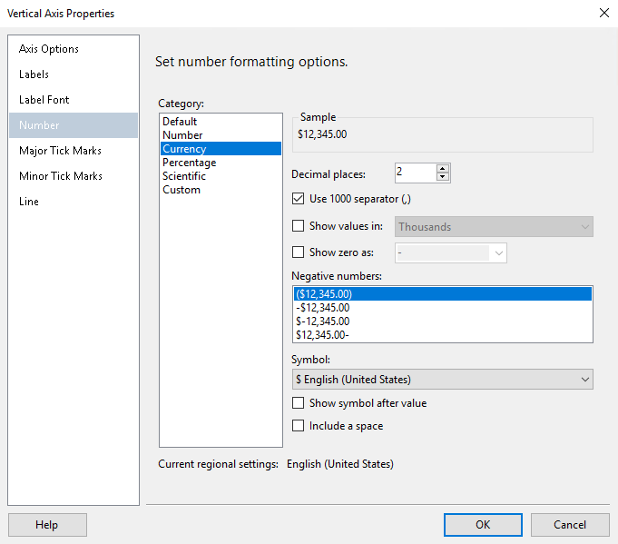
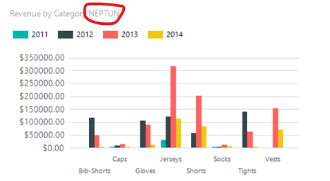

# Exercise 2: Visualization

**This exercise is to be completed individually for 5 points.**

The table report shows all sales. That is not useful to get a quick overview. A diagram would be more helpful. Create a diagram that displays the sales per category.

## Inserting a diagram

1. Switch to _Design_ tab and drag a _Chart_ from the _Toolbox_ to the canvas to the table's right side.  You might have to wait a while for the diagram wizard to open. Choose a column diagram.

1. Drag _LineTotal_ from the _Report Data_ pane to the diagram. **Do not release the left mouse button.** A window will appear beside the diagram. The window is titled _Chart Data_. Go to the "∑values" field with your mouse. Release the left mouse button now.

    

    This makes the totals be displayed on the vertical axis.

1. Next, drag _Subcat_ field into _Category Groups_ and _Date_ into _Series Groups_.

    

    The horizontal axis displays the categories, and we get separate columns per date series.

1. Right, click label `[Date]` and select _Series Groups Properties_. Click on the **_fx_** button in _Group Expressions_.

    

    The following expression: `=Year(Fields!Date.Value)`

    

    This will produce a yearly breakdown per category.

1. Press OK in both windows. Before checking the _Preview_, increase the height of the chart; otherwise, the labels at the bottom will remain hidden:

    

1. Check the preview now: it shows the sales per category for each year separately.

    

## Format the diagram

There are a few changes to make.

1. Click _Chart title_ and replace the title: "Revenue by category NEPTUN" **with your own Neptun code**.

1. Right-click `<<Expr>>` in _Series Groups_ and choose _Series Groups Properties_. Click on the **_fx_** button next to _Label_. Type: `=Year(Fields!Date.Value)`. Now the label will be the year part of the date.

1. Right-click the vertical axis and select _Vertical Axis Properties_.

    

    Select _Currency_ from the _Number_ group and fill out as previously:

    

1. Check the preview now: the diagram will look much better (and also has your Neptun code):

    

!!! example "SUBMISSION"
    Create a screenshot of the **report preview** page. Save the screenshot as `f2.png` and submit it with the other files of the solution. The screenshot shall include Visual Studio and the report preview. Verify that your **Neptun code** is visible in the diagram title!
