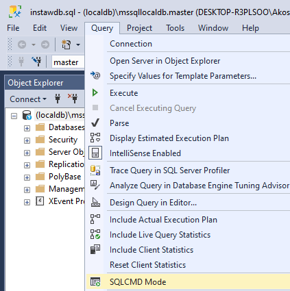

# Reporting Services

In this lab we will work with _Microsoft SQL Server Reporting Services_, a tool we have not seen before. We will start working together, then some of the exercises will be individual work. You shall submit the solution of all exercises.

## Pre-requisites and preparation

Required tools to complete the tasks:

- Windows
- Microsoft SQL Server: The free Express version is sufficient, or you may also use _localdb_ installed with Visual Studio
- [SQL Server Management Studio](https://docs.microsoft.com/en-us/sql/ssms/download-sql-server-management-studio-ssms)
- Database initialization script: [adventure-works-2014-oltp-script.zip](adventure-works-2014-oltp-script.zip)
- Microsoft Visual Studio 2019: The free Community edition is sufficient
- Report Server Project support for Visual Studio: [Microsoft Reporting Services Projects extension](https://marketplace.visualstudio.com/items?itemName=ProBITools.MicrosoftReportProjectsforVisualStudio) (It is recommended to [keep the extension up to date](https://docs.microsoft.com/en-us/visualstudio/extensibility/how-to-update-a-visual-studio-extension?view=vs-2019).)
- GitHub account and a git client

Materials for preparing for this laboratory:

- Using Microsoft SQL Server: [description](https://bmeviauac01.github.io/datadriven-en/db/mssql/) and [video](https://www.youtube.com/watch?v=kK1i_HUujAc)
- SQL Reporting Services [official tutorial](https://docs.microsoft.com/en-us/sql/reporting-services/create-a-basic-table-report-ssrs-tutorial)

## Initial steps

Keep in mind that you are expected to follow the [submission process](../GitHub.md).

### Create and check out your Git repository

1. Create your personal git repository at: <TBD>

1. Wait for the repository creation to complete, then check out the repository.

    !!! tip ""
        If in university computer laboratories you are not asked for credentials to log in to GitHub when checking out the repository, the operation may fail. This is likely due to the machine using someone else's GitHub credentials. Delete these credentials first (see [here](../GitHub-credentials.md)), then retry the checkout.

1. Create a new branch with the name `solution` and work on this branch.

1. Open the checked out folder and type your Neptun code into the `neptun.txt` file. There should be a single line with the 6 characters of your Neptun code and nothing else in this file.

### Create the Adventure Works 2014 database

We will work with the _Adventure Works_ sample database. This database contains the operational information of a fictional retail company. Instead of understanding the database contents, we will use a few predefined queries that list product purchases.

1. Download  [adventure-works-2014-oltp-script.zip](adventure-works-2014-oltp-script.zip) and extract it to folder `C:\work\Adventure Works 2014 OLTP Script` (create the folder if it does not exist yet).

    !!! important ""
        The folder name should be as above, otherwise you need change the path in the sql script:

        ```sql
        -- NOTE: Change this path if you copied the script source to another path
        :setvar SqlSamplesSourceDataPath "C:\work\Adventure Works 2014 OLTP Script\"
        ```

        If you need to edit the path, make sure to keep the trailing slash!

1. Connect to Microsoft SQL Server using SQL Server Management Studio. Use the following connection details.

    - Server name: `(localdb)\mssqllocaldb`
    - Authentication: `Windows authentication`

1. Use _File / Open / File..._ to open `instawdb.sql` from the folder created above. **Do not execute it yet!** First you should turn on SQLCMD mode: in the _Query_ menu click _SQLCMD Mode_; then click _Execute_.

    

1. Verify whether the database and its contents are created. Select _Databases_ in the _Object explorer_ on the left and click _Refresh_. The _AdventureWorks2014_ database shall appear with a number of tables inside.

    .

1. Open a new SQL Query window on this database (right click the database and chose _New query_), and execute the following script **with your own Neptun code** substituted:

    ```sql
    update Production.Product set Name='NEPTUN'+Name
    ```

    Check the contents of table `Production.Product` and verify if it has your Neptun code in the product names: right click the table and chose _Select top 1000 rows_.

    !!! warning "IMPORTANT"
        It is important that your Neptun code is listed in the names. You will need to create screenshots in the following exercises, and your Neptun code **must** appear on these images.
