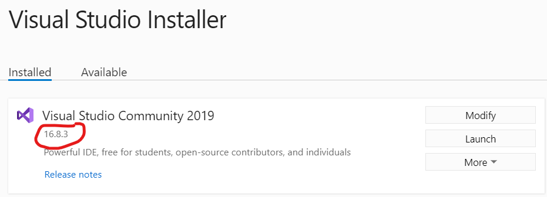
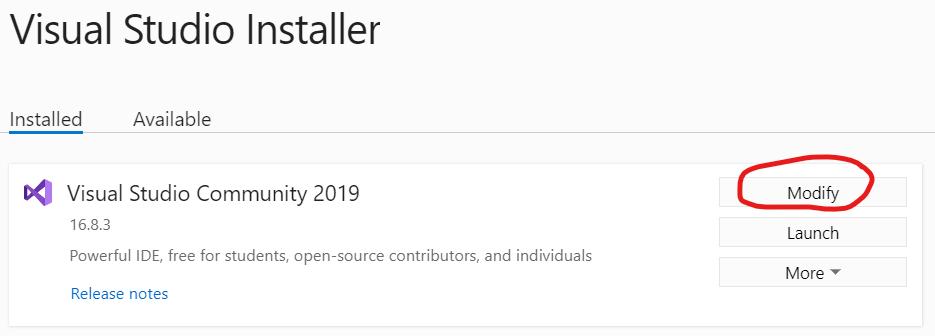

# Install Visual Studio & .NET Core SDK

In some of the exercises require Microsoft Visual Studio **version 2019 16.6 or newer**. The free [Community edition](https://visualstudio.microsoft.com/vs/community/) is sufficient for solving these exercises.

You can check the version by starting the _Visual Studio Installer_:



!!! info "VS Code"
    The exercises can also be solved using the platform-independent **Visual Studio Code**. The skeletons of the exercises are prepared for Visual Studio. If you are working with VS Code, you need to configure your environment.

## Visual Studio workloads

When installing Visual Studio, the following [workloads](https://docs.microsoft.com/en-us/visualstudio/install/install-visual-studio?view=vs-2019#step-4---choose-workloads) have to be selected:

- ASP.NET and web development
- .NET Core cross-platform development


An existing installation can be [_modified_](https://docs.microsoft.com/en-us/visualstudio/install/modify-visual-studio?view=vs-2019) using the _Visual Studio Installer_.



## Check and install .NET Core SDK

Visual Studio might install certain versions of the .NET Core SDK. To check if you have the right version, use the `dotnet` CLI: in a console execute the `dotnet --list-sdks` command. This works on Linux and Mac too. It will print something similar:

```hl_lines="2"
C:\>dotnet --list-sdks
3.1.404 [C:\Program Files\dotnet\sdk]
5.0.101 [C:\Program Files\dotnet\sdk]
```

If you see version **3.1** in this list, then you are good to go. Otherwise install the SDK [from here](https://dotnet.microsoft.com/download/dotnet-core/3.1).